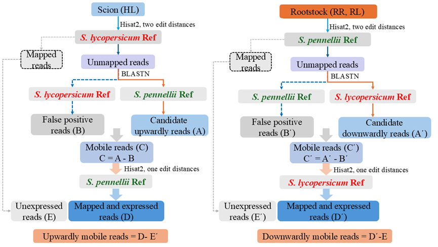

**Identification of long-distance mobile mRNAs responding to drought stress in heterografted tomato plants**

[](https://github.com/kanghuadu)

## 1. Create new environments
```R
mamba create -n RNA-seq 
# 
mamba activate RNA-seq 
```
## 2. Install software
```R
mamba install -y hisat2 stringtie diamond samtools fastqc fastp bedtools bowtie2
```
----

**A pipeline of bioinformatic analysis to identify the mobile mRNAs.**

----
## 3.Acknowledgement
We sincerely appreciate [Orctyr](https://github.com/orctyr/) for their valuable contributions.